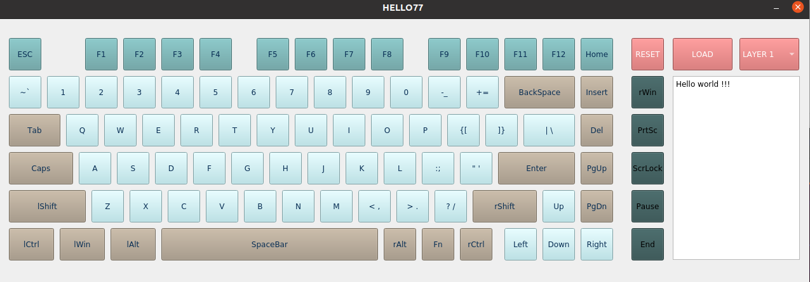
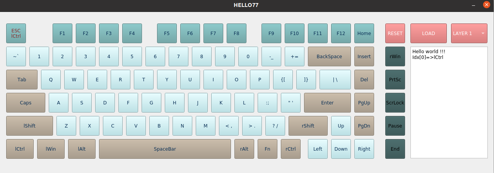

# README

## 1 简介

HelloWord Keyboard 键盘配置软件，提供以下功能（需要使用配套的键盘固件才可实现）：

- 82键改键，每一个键都可映射到标准87键配列中的任意一个键。

- 支持5个键盘层的配置，写入键盘时选择键盘层即可。

  

更多功能，待开发：

- 灯光设置功能。
- 扩展模块功能配置，刷图片功能。
- 刷机功能

## 2 相关资料

### 2.1 USB键盘HID键码对照表与数据格式

USB键盘数据包含8个字节

BYTE1 -- 特殊按键 不需要关注usage_id
    |--bit0:  Left Control是否按下，按下为1 
    |--bit1:  Left Shift 是否按下，按下为1 
    |--bit2:  Left Alt  是否按下，按下为1 
    |--bit3:  Left GUI（Windows键） 是否按下，按下为1 
    |--bit4:  Right Control是否按下，按下为1 
    |--bit5:  Right Shift 是否按下，按下为1 
    |--bit6:  Right Alt  是否按下，按下为1 
    |--bit7:  Right GUI  是否按下，按下为1 

BYTE2 -- 必须为0，传其他值会失效

BYTE3-BYTE8 当前按下的普通按键键值，也就是最多六个按键。

```xml
224 E0 Keyboard LeftControl 
225 E1 Keyboard LeftShift
226 E2 Keyboard LeftAlt
227 E3 Keyboard Left GUI
228 E4 Keyboard RightControl
229 E5 Keyboard RightShift
230 E6 Keyboard RightAlt 
231 E7 Keyboard Right GUI
```

## 3 界面与交互设计

### 3.1 界面

瀚文75键位区（左侧82键）

补充键位（墨绿色）

复位按钮（RESET） 

Layer选项  （LAYER）

下载按钮（Load）

日志窗口（记录操作和下载是否成功）



## 3.2 交互

1）要点

- 界面显示的是默认键位
- 通过点击能够操作某键位进入编辑模式，给予重映射键值， 界面会显示哪些默认键位已经被修改
- 点击RESET可清空当前设置

2）操作实例（将 0号键映射为lCtrl键位，先点击ESC，再点击lCtrl）

​	点击ESC键（0号键），按键颜色变为金色， 0号键进入编辑模式

​	在编辑模式点击87键中任意一个，可以改变其映射值，如点击lCtrl即可将 0号键映射为lCtrl键位。修改后的键字符会变红色。




## 4 功能设计

键映射

（1）HW键盘位置编码， 从esc到right依次递增+1，即为(0-81)

（2）USB-HID协议中usageID编码 (87个键)

协议：

改键位数据包= 8bytes包头（0x77, 0xF1, 0xFF, 0xA5,0xA5,0xA5,0xA5,0xA5 ）+ 82bytes（键位映射）+ 1byte Layer数值

## 5 打包

### 5.1 linux

采用linuxdeployqt

build下目录运行 linuxdeployqt Hello77 -appimage

***linuxdeployqt 源码安装方式： Building from source***

If you just would like to bundle your application for x86_64 platforms, it is normally not necessary that you build `linuxdeployqt` yourself. Instead, download __linuxdeployqt-x86_64.AppImage__ from the [Releases](https://github.com/probonopd/linuxdeployqt/releases) page and `chmod a+x` it. This bundle, by the way, has been generated using `linuxdeployqt` itself as part of our Travis CI continuous build pipeline.

So, if you are on another platform (e.g. i686, ARM) or would like to compile from source, here are the steps:

* Get and build linuxdeployqt e.g., using Qt 5.7.0 (you could use this [Qt Creator AppImage](https://bintray.com/probono/AppImages/QtCreator#files) for this)

```
sudo apt-get -y install git g++ libgl1-mesa-dev
git clone https://github.com/probonopd/linuxdeployqt.git
# Then build in Qt Creator, or use
export PATH=$(readlink -f /tmp/.mount_QtCreator-*-x86_64/*/gcc_64/bin/):$PATH
cd linuxdeployqt
qmake
make
```

* Optional if you want to install `linuxdeployqt` into your Qt installation, and make it a part of your Qt just like any other tool (qmake, etc.)

```
sudo make install
```

* Build and install [patchelf](https://nixos.org/patchelf.html) (a small utility to modify the dynamic linker and RPATH of ELF executables; similar to `install_name_tool` on macOS). To learn more about this, see http://blog.qt.io/blog/2011/10/28/rpath-and-runpath/

```
wget https://nixos.org/releases/patchelf/patchelf-0.9/patchelf-0.9.tar.bz2
tar xf patchelf-0.9.tar.bz2
( cd patchelf-0.9/ && ./configure  && make && sudo make install )
```

* Optional if you want to generate AppImages: Download [appimagetool](https://github.com/AppImage/AppImageKit/releases) and put it into your $PATH, e.g., into `/usr/local/bin`. Make sure it is renamed to `appimagetool` and is `chmod a+x`

```
sudo wget -c "https://github.com/AppImage/AppImageKit/releases/download/continuous/appimagetool-x86_64.AppImage" -O /usr/local/bin/appimagetool
sudo chmod a+x /usr/local/bin/appimagetool
```

software/linuxdeployqt/bin$ linuxdeployqt --version

再把这个可执行文件扔进/usr/local/bin目录，这样，我们就可以在其他目录访问了